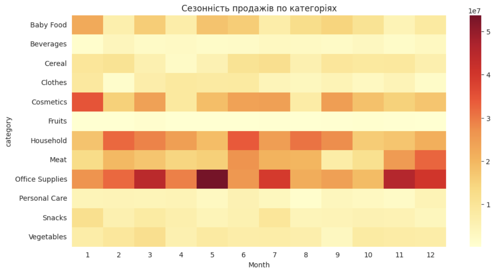
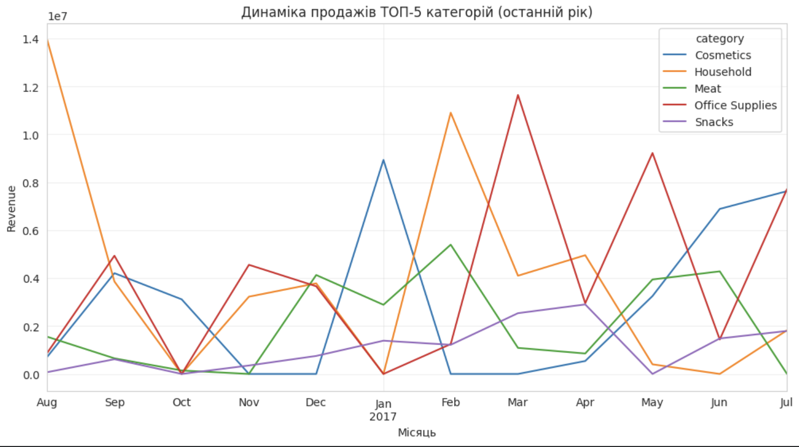
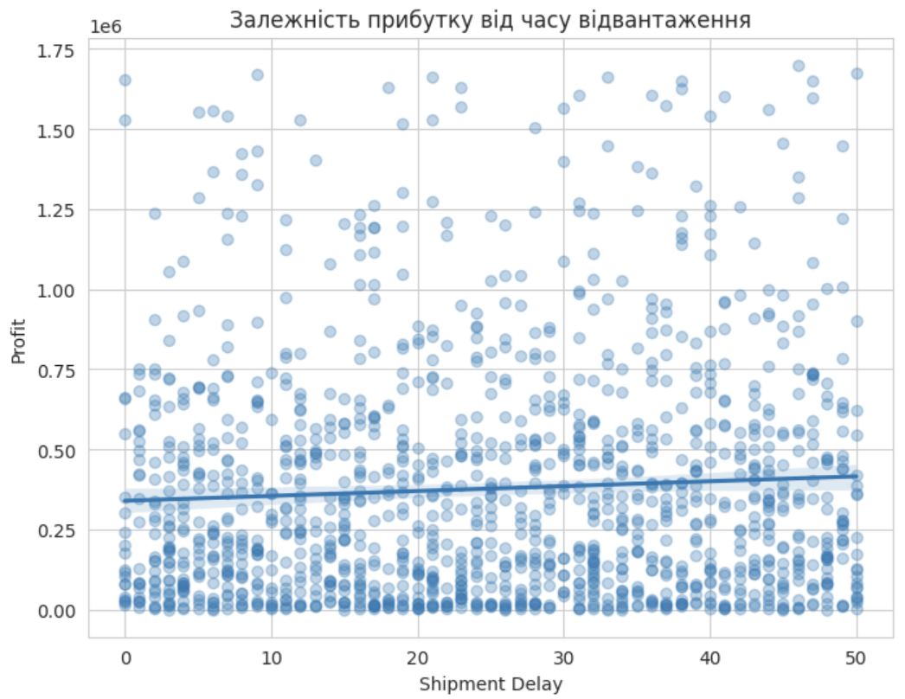
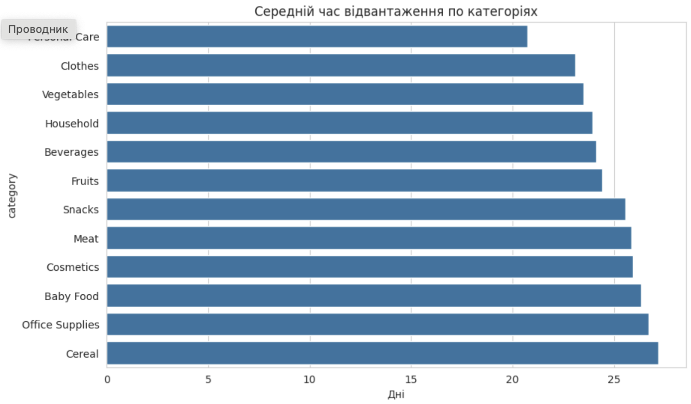
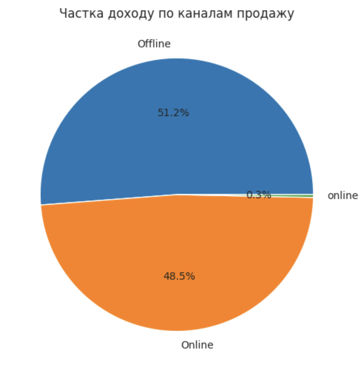
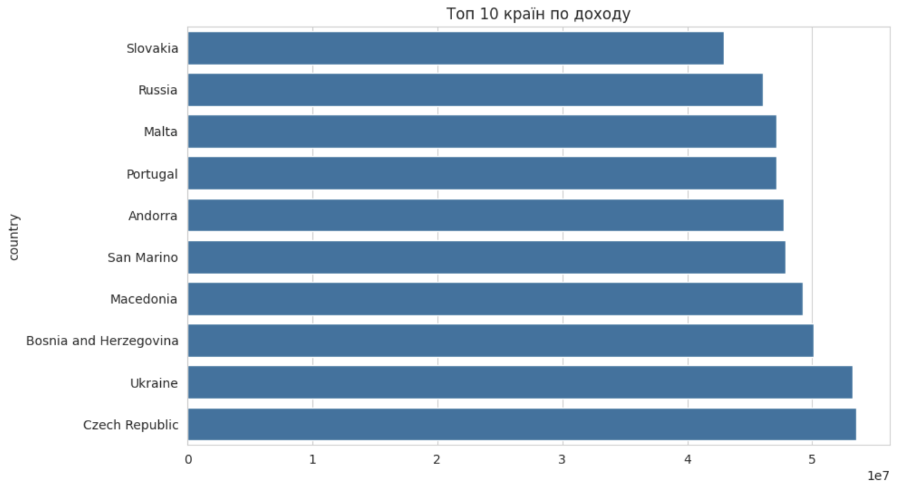

# 📊 Data Cleaning & Exploratory Analysis

## 🚀 Project Overview
This project focuses on analyzing e-commerce sales data to identify trends, seasonality, and key business drivers using Python.

---

## 🎯 Objectives
- Analyze sales performance across categories and countries  
- Identify seasonal patterns in sales  
- Evaluate delivery performance and its impact on profit  
- Analyze revenue distribution across channels  

---

## 🛠 Tools
- Python (pandas, matplotlib, seaborn) 
- Google Colab  

---

## 📂 Project Structure
- `notebooks/` — analysis notebook  
- `data/` — dataset  
- `assets/` — visualizations  

---

## 📈 Visualizations

### 🔥 Sales Seasonality by Category

Sales show clear seasonal patterns across categories, indicating demand fluctuations throughout the year.

---

### 📈 Sales Trend (Top 5 Categories)

Top-performing categories demonstrate distinct growth and decline trends over time.

---

### 🎯 Profit vs Delivery Time

Longer delivery times are associated with changes in profitability, indicating operational impact on revenue.

---

### 🚚 Average Delivery Time by Category

Delivery performance varies across categories, highlighting potential areas for logistics optimization.

---

### 📣 Revenue Share by Sales Channel

Sales are distributed unevenly across channels, suggesting opportunities for marketing optimization.

---

### 🌍 Top 10 Countries by Revenue

Revenue is concentrated in a limited number of countries, indicating key markets.

---

## 📝 Key Insights
- Sales exhibit strong seasonal patterns across product categories  
- A small number of categories generate the majority of revenue  
- Delivery time impacts profitability and operational efficiency  
- Certain countries and channels dominate overall sales performance  

---

## ▶️ How to Run
1. Open notebook in Google Colab  
2. Load dataset  
3. Run all cells  

---

## 📬 Author
Mykhailo Turchyniuk
